# SmartFA: High-Level Plan

Last updated: 2026-10-07

## 1. Goal

Remove the commission-paid FA from personal financial planning in Singapore. A user should be able to:

1. Answer a questionnaire (about 10–15 minutes).
2. Get a needs analysis: what they need, how much, in what priority order, and why.
3. Compare real products that meet those needs, from all major providers.
4. Follow a guide to buy or set up each item directly, with no agent involved.

## 2. Scope and phasing

The research scope is **full financial planning**. The build is phased so each release is useful by itself. Phasing sets the build order. It does not narrow the scope.

| Module | Covers | Build order | Why this order |
|---|---|---|---|
| M1 Protection | Health (MediShield Life, Integrated Shield Plans, riders), life (term, whole life, DPS, HPS), critical illness, disability income, CareShield Life + supplements, personal accident | 1st | This is where FA mis-selling does the most damage. Needs are the most rule-friendly. Direct-purchase channels already exist (DPI, compareFIRST). |
| M2 CPF & Retirement | CPF accounts, retirement sums, CPF LIFE plans, top-ups, SRS, housing withdrawals | 2nd | Government rules are deterministic and public, so the engine logic is simple. |
| M3 Savings & Investments | Emergency fund, SSB/T-bills, endowments, ILPs, unit trusts, ETFs, robo-advisers, CPFIS | 3rd | Highest licensing risk (see G1). Largest product universe. |
| M4 Estate | Wills, CPF nomination, insurance nominations, LPA, AMD | 4th | Mostly education and guides, with little product comparison. |
| M5 Tax | Reliefs tied to the above (CPF top-up, SRS, life insurance relief) | Folded into M2/M3 | |

## 3. Phases and gates

```
Phase 0  Planning ......................... DONE (this commit)
Phase 1  Research (parallel, 14 cards) .... RESEARCH.md
   └─ Gate G1: Legal framing decision  (needs R00, R01)
   └─ Gate G2: Data sourcing decision  (needs R10)
Phase 2  Design specs ..................... schema, questionnaire, rules, UX, compliance
   └─ Gate G3: Spec review (human sign-off on rules + disclaimers)
Phase 3  Build MVP = Module M1 ............ site, engine, questionnaire, results, glossary, wiki, guides
Phase 4  Data pipeline .................... scheduled refresh, diff review, link check, staleness flags
   └─ Gate G4: Launch readiness (compliance checklist, persona tests pass, content fact-checked)
Phase 5  Expand ........................... M2 → M3 → M4
Phase 6  Operate .......................... monthly data review, user feedback, rule updates
```

### Dependency graph

```mermaid
graph TD
  R00[R00 Legal & regulatory] --> G1{G1 Legal framing}
  R01[R01 Landscape & gap] --> G1
  R10[R10 Data sourcing] --> G2{G2 Data sourcing}
  R02[R02 Health] --> D01
  R03[R03 Life & protection] --> D01
  R09[R09 Needs methodology] --> D02 & D03
  G1 --> D02[D02 Questionnaire spec]
  G1 --> D03[D03 Rules spec]
  G1 --> D05[D05 Compliance spec]
  G2 --> D01[D01 Data schema]
  R12[R12 User pain points] --> D04[D04 UX / IA]
  R01 --> D04
  D01 --> B02[B02 Engine]
  D02 --> B02
  D03 --> B02
  B01[B01 Site scaffold] --> B03[B03 Questionnaire UI]
  B02 --> B03 --> B04[B04 Results & compare UI]
  D01 --> C05[C05 Product data entry]
  D01 --> P01[P01 Refresh pipeline]
  R02 & R03 & R11 --> C01[C01-C04 Glossary, wiki, guides]
  B04 & C05 & C01 & P01 & D05 --> G4{G4 Launch}
```



`B01` (site scaffold) has no research dependency. It can start at any time.

## 4. Gate G1: the legal framing decision (OPEN)

Under Singapore's Financial Advisers Act (FAA), "advising others concerning any investment product" and recommending life policies count as regulated financial advisory services. MAS treats algorithm-based "digital advisers" (robo-advisers) as FA service providers. **R00 must confirm the current position.** The answer decides what the engine is allowed to output.

| Branch | What the engine outputs | Licensing (verify in R00) | Trade-off |
|---|---|---|---|
| **A: Needs + neutral compare** | Coverage *types* and *amounts* ("Term life to age 65, about $X; IP at private-hospital tier"). Then a neutral, unranked or user-sorted table of every matching product. | Likely falls under education/information. Similar to what compareFIRST and MoneySense already publish. | Lowest risk. The user makes the final pick, so it is less "magic". |
| **B: Ranked named policies** | "For you: Product X from Insurer Y, then Product Z." | Likely a regulated FA service: a licence or exemption, plus suitability, record-keeping and complaints obligations. | Strongest product. Heavy compliance burden and cost. |
| **C: A now, B via partner** | Branch A publicly. Ranked advice offered through a licensed fee-only adviser partner, or a MAS sandbox entry. | The partner holds the licence. | Keeps independence only if the partner is fee-only. Adds a business relationship. |

**Default until G1 closes:** design everything for Branch A, and keep the engine's data model able to rank (Branch B) behind a feature flag. Nothing built in Phase 2–3 should be thrown away under any branch.

**G1 output:** `research/R00-decision-memo.md`. It holds the chosen branch, the reasoning, the disclaimers required, and anything a lawyer must still confirm.

## 5. Gate G2: data sourcing decision

R10 decides how product data gets in:

- **Manual curation:** humans or agents read product summaries and enter JSON, with sources cited.
- **Semi-automated:** scripts fetch provider pages and PDFs, an LLM extracts the fields, and a human reviews the diff PR.
- **Licensed feed:** compareFIRST or an aggregator data licence, if one exists.

Insurers' terms of use, copyright on brochures and robots.txt all constrain this. **The default assumption is semi-automated with mandatory human review.** No automated change ever merges without review.

## 6. Non-negotiable design constraints

1. **A deterministic, rule-based engine.** Every output line links to the inputs and rule IDs that produced it. No ML scoring of products.
2. **No user data leaves the browser.** No accounts in the MVP. Answers stay in browser memory and optional `localStorage`, plus an optional export as a JSON/PDF summary. This keeps PDPA exposure minimal.
3. **Every fact has provenance.** `source_url`, `retrieved_at`, `last_verified` and `verified_by` are required on every product, premium and scheme record. Pages show "Last checked: DATE". Records older than their staleness threshold are flagged in the UI.
4. **Independence policy.** No commission or affiliate revenue that could influence ordering. If affiliate links are ever used, they must apply to every provider equally and must never affect ranking. R13 decides.
5. **Disclaimers and escalation.** Every results page says what SmartFA is not. It also says when a user *should* see a licensed fee-only adviser, for example with complex medical history, a business owner, or estate disputes.

## 7. Success criteria for MVP (Module M1)

- A 25-year-old single person, a 35-year-old parent of two and a 55-year-old pre-retiree (plus about 20 other personas in `engine/tests/personas/`) each get output that a fee-only adviser reviewer agrees is reasonable.
- All 7 IP insurers and at least 8 life insurers have their core protection products in `data/`. Every record must have been verified within 90 days.
- Every glossary term used on a results page links to its definition.
- Every "how to apply" link passes the weekly link check.
- Lighthouse accessibility ≥ 95, and the site is usable on a phone.

## 8. How to delegate

See [TASKS.md](TASKS.md). Each card owns exactly one file or directory, so parallel agents never edit the same file. Research cards (R00–R13) can all run at once. Design cards wait for their research inputs. Build cards wait for their specs.
